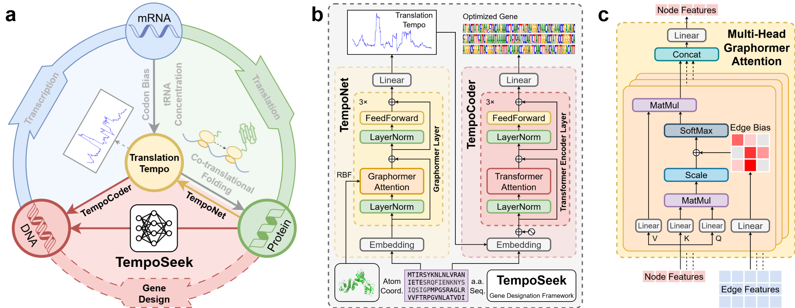

# TempoSeek

**Deep learning pipeline from protein structure to codon design**

TempoSeek is a deep-learning-based bioinformatics tool that predicts translation tempo from protein 3D structures and designs optimal codon sequences accordingly. The pipeline consists of two serially connected neural network models: **TempoNet** and **TempoCoder**.

---

## Pipeline Overview



*(a) Pipeline overview. (b) TempoSeek architecture. (c) Multi-head attention mechanism (GraphormerAttention).*

---

## Project Structure

```
TempoSeek-Release-Clean/
├── ckpts/                          # Pretrained model weights (download from Zenodo)
│   ├── TempoNet.ckpt
│   └── TempoCoder.ckpt
├── figs/                           # Diagrams and figures
│   └── Pipeline_and_model_structure.png
├── preprocessed_data.tar.gz        # Training data (download from Zenodo)
├── info/                           # Biological reference data
│   ├── codon.csv                   # Codon frequency and k-values
│   └── tRNA.csv                    # tRNA abundance and mappings
├── notebooks/                      # Jupyter Notebooks
│   ├── build_dataset.ipynb         # Dataset construction
│   ├── process_data.ipynb          # Data preprocessing
│   └── tempo_statistic.ipynb       # Tempo statistical analysis
└── srcs/                           # Core source code
    ├── train.py                    # Training entry point (Hydra config)
    ├── config/                     # Hydra configuration files
    │   ├── config.yaml             # Master configuration
    │   ├── data/                   # Data configuration
    │   ├── model/                  # Model hyperparameters
    │   ├── experiment/             # Experiment configs (10-fold CV)
    │   └── trainer/                # Trainer configuration
    ├── model/                      # Model implementations
    │   ├── TempoNet/               # TempoNet model
    │   │   ├── model.py            # Graphormer network definition
    │   │   └── dataloader.py       # Training data loader
    │   └── TempoCoder/             # TempoCoder model
    │       ├── model.py            # Transformer network definition
    │       └── dataloader.py       # Training data loader
    ├── predict/                    # Inference pipeline
    │   ├── dataset.py              # Inference datasets & DataLoaders
    │   ├── TempoNet.py             # PDB/CIF → tempo CSV
    │   ├── TempoCoder.py           # tempo CSV → codon CSV
    │   ├── TempoSeek.py            # One-click full pipeline
    │   └── utils.py                # Logger and utilities
    └── utils/                      # Shared utilities
        ├── dataset.py              # TRMPDataset (cluster data structure)
        ├── schedulers.py           # Noam LR Scheduler
        └── utils.py                # Vocab, tempo calculation, k-value
```

---

## Installation

### Dependencies

- Python ≥ 3.11
- PyTorch ≥ 2.0
- PyTorch Lightning ≥ 2.0
- Hydra
- BioPython
- NumPy, Pandas, tqdm
- Matplotlib (optional, for plotting)
- OmegaConf
- TensorBoard

### Quick Install

```bash
# Clone the repository
git clone https://github.com/PKU-Zhang-Lab/TempoSeek.git
cd TempoSeek-Release-Clean

# Recommended: create a conda environment
conda create -n temposeek python=3.11
conda activate temposeek

# Install dependencies
pip install torch torchvision --index-url https://download.pytorch.org/whl/cu132   # CUDA 13.2
pip install pytorch-lightning hydra-core biopython numpy pandas tqdm matplotlib omegaconf tensorboard ipykernel
```

### Download

**For inference** — only pretrained checkpoints are needed:

Pretrained model weights are available on Zenodo. Download and place them in the `ckpts/` directory:

| File | Description |
|------|-------------|
| `ckpts/TempoNet.ckpt` | Protein structure → translation tempo |
| `ckpts/TempoCoder.ckpt` | Amino acid + tempo → codon |

**For training** — training data is also required:

1. **Zenodo** (recommended): Download `preprocessed_data.tar.gz`, place it in the project root, and extract:
   ```bash
   tar -xvf preprocessed_data.tar.gz
   ```
   This will create the `data/` directory containing `NCBI_pkl/`, `AFDB_pkl/`, and `fold_list.pkl`.

2. **Build from scratch**: Run the notebooks in `notebooks/` to download and process raw data yourself:
   ```bash
   pip install requests        # Required for data download
   # then open and run:
   #   notebooks/process_data.ipynb
   #   notebooks/build_dataset.ipynb
   ```


---

## Usage

### Inference (Full Pipeline)

Run the complete TempoSeek pipeline on PDB/CIF structure files:

```bash
# Basic usage
python srcs/predict/TempoSeek.py -i ./pdbs -o ./results

# Generate tempo profile figures and B-factor colored PDB
python srcs/predict/TempoSeek.py -i ./pdbs -o ./results --figure --bfactor

# CPU inference
python srcs/predict/TempoSeek.py -i ./pdbs -o ./results --device cpu

# Multi-sample codon design
python srcs/predict/TempoSeek.py -i ./pdbs -o ./results -n 5 -t 1.0
```

**Argument Reference**:

| Argument | Description | Default |
|----------|-------------|---------|
| `-i` / `--input-dir` | Input PDB/CIF directory (required) | — |
| `-o` / `--output-dir` | Output directory | `{input_dir}/temposeek_output` |
| `-q` / `--quiet` | Suppress all output | `False` |
| `-f` / `--force` | Force overwrite existing output | `False` |
| `--debug` | Print full error tracebacks | `False` |
| `--temponet-ckpt` | TempoNet checkpoint path | `ckpts/TempoNet.ckpt` |
| `--tempocoder-ckpt` | TempoCoder checkpoint path | `ckpts/TempoCoder.ckpt` |
| `--batch-size` | Token limit per batch | `5000` |
| `--device` | Inference device | `cuda` |
| `-t` / `--temperature` | Sampling temperature (0=greedy) | `0` |
| `-n` / `--n-samples` | Number of codon samples per residue | `1` |
| `--figure` | Save tempo profile as PNG | `False` |
| `--bfactor` | Save PDB with tempo as B-factor | `False` |

### Step-by-Step Inference

#### Step 1: TempoNet — Structure → Tempo Prediction

```bash
python srcs/predict/TempoNet.py -i ./pdbs -o ./tempo_results --figure --bfactor
```

Output: `<name>_tempo.csv` per protein (columns: res_idx, chain, aa, tempo)

#### Step 2: TempoCoder — Tempo → Codon Design

```bash
python srcs/predict/TempoCoder.py -i ./tempo_results -o ./codon_results
```

Output: `<name>_codon.csv` (columns: res_idx, aa, input_tempo, codon, codon_tempo) and `<name>.txt` (DNA sequence)

### Training

> **Note**: An experiment config is **required** for training — use the `experiment=<model>/<config>` syntax. Available configs are listed below.

```bash
# Train TempoNet (default: d512l3)
python srcs/train.py experiment=TempoNet/d512l3

# Train TempoCoder (default: d512l3)
python srcs/train.py experiment=TempoCoder/d512l3

# Override hyperparameters
python srcs/train.py experiment=TempoNet/d512l3 model.n_layers=6

# Multi-run training
python srcs/train.py --multirun experiment=TempoNet/d512l3,experiment=TempoNet/d128l3
```

Training configuration is managed via Hydra. Configuration files are located in `srcs/config/`:

- `config.yaml` — Master config (global seed, device, log directory)
- `model/TempoNet.yaml` — TempoNet hyperparameters
- `model/TempoCoder.yaml` — TempoCoder hyperparameters
- `data/TempoNet.yaml` / `data/TempoCoder.yaml` — Data paths and batch size
- `trainer/default.yaml` — PyTorch Lightning Trainer config
- `experiment/TempoNet/` — TempoNet experiment configs: `d128l3`, `d128l6`, `d256l3`, `d256l6`, `d512l3` (default), `d512l6`, `d512l12`
- `experiment/TempoCoder/` — TempoCoder experiment configs: `d128l3`, `d128l6`, `d256l3`, `d256l6`, `d512l3` (default), `d512l6`

---

## Output Formats

### TempoNet Output (CSV)

```
res_idx,chain,aa,tempo
1,A,M,2.345678
2,A,A,3.123456
...
```

### TempoCoder Output (CSV)

```
res_idx,aa,input_tempo,codon,codon_tempo
1,M,2.345678,ATG,3.456789
2,A,3.123456,GCT,2.987654
...
```

### DNA Sequence (TXT)

A plain text file containing the full DNA sequence:

```
ATGGCTGCT...
```

---

## Citation

If you use TempoSeek in your research, please cite the relevant paper (TBD).
